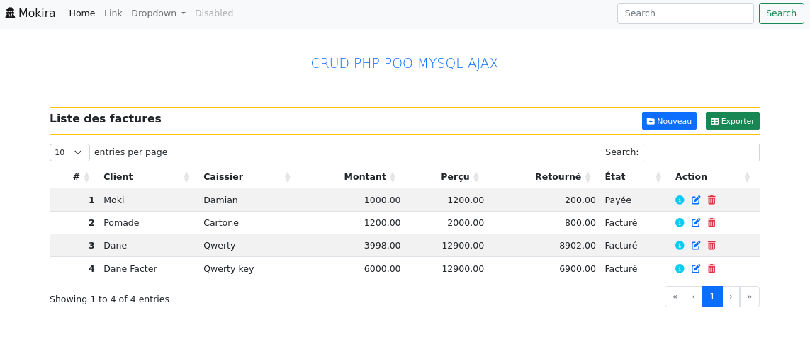

# invoice-crud


Implementation of an invoice management program in PHP + MySQL using AJAX.

<div align="center">
    
</div>


## Databse creation

```sql
START TRANSACTION;

CREATE DATABASE IF NOT EXISTS crud_facture CHARACTER SET 'utf8';
CREATE USER IF NOT EXISTS sideproject IDENTIFIED BY 'motdepasse';
GRANT ALL PRIVILEGES ON crud_facture.* TO sideproject;

USE crud_facture;

CREATE TABLE IF NOT EXISTS factures (
    id INT AUTO_INCREMENT PRIMARY KEY,
    customer VARCHAR(45),
    cashier VARCHAR(45),
    amount DECIMAL(12, 2),
    received DECIMAL(12, 2),
    returned DECIMAL(12, 2) DEFAULT '0.00',
    `state` VARCHAR(16),
    CONSTRAINT CK_FAC_STA CHECK (`state` IN ('Facturé', 'Payée', 'Annulée')),
    CONSTRAINT CK_FAC_AMO CHECK (`amount` >= 0.0)
)ENGINE=InnoDB;

COMMIT;

```

OR execute the following command line.

```sh
mysql -u root -p < database.sql
```

## Start server
You can start the web server using the following command line.

```sh
php -S 0.0.0.0:8080
```
